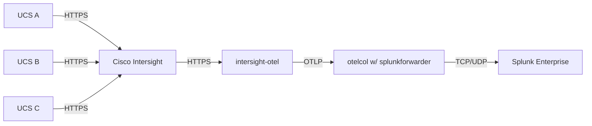

## BRKGRN-1022: Using Splunk & OpenTelemetry for centralized insights to achieve your sustainability goals

[About Cisco Live](https://www.ciscolive.com/global.html) | [**Link to Session Presentation**](/static/) | [**Link to Session Recording**](https://www.ciscolive.com) 

### Session Demo Objective

Ingest energy consumption data from UCS hosts managed through [Cisco Intersight](https://intersight.com/help/saas/getting_started/overview) into [Splunk](https://splunk.com), leveraging the [OpenTelemetry standard](https://opentelemetry.io/). Utilize the the [Splunk Sustainability Toolkit](https://splunkbase.splunk.com/app/6343) to report on CO₂ equivelant (CO₂e) emissions through correlation of data from [Electricity Maps](https://www.electricitymaps.com/) data and enable the following two operational use-cases:
1. **Workload Activity Scheduler:** Adjust the planned schedule of electricity intensive activities to minimize their carbon footprint
2. **Change Workload Location:** Compute Potential CO₂e Savings From Location Changes

### Methodology



#### Notes

1. Intersight does not natively export through the OpenTelemetry protocol, so [intersight-otel](https://github.com/cgascoig/intersight-otel) is used to help. It pulls data from Intersight via HTTPS API and converts into the OpenTelemetry standard (OTLP).
2. Splunk Enterprise does not natively ingest OpenTelemtery, therefore, we need an [OpenTelemetry Collector](https://github.com/open-telemetry/opentelemetry-collector) to ingest OpenTelemetry and write JSONL files to a directory that a Splunk forwarder watches.
3. The rest of the magic happens inside of Splunk with the Splunk Sustainability Toolkit!

### Setup

> [!IMPORTANT]
> **Pre-requisites:**
> 1. Cisco Intersight with your UCS devices onboarded
> 2. Splunk Enterprise (or Cloud)

1. Setup Intersight OpenTelemetry Collection
    1. [intersight-otel](https://github.com/cgascoig/intersight-otel): The easiest way to get started may be to pull down a binary of the [latest release](https://github.com/cgascoig/intersight-otel/releases) (for more information on this utility, check out Chris Gascoigne's Cisco Live 2023 [session slides](https://www.ciscolive.com/c/dam/r/ciscolive/emea/docs/2024/pdf/DEVNET-2118.pdf)). See [intersight_otel.toml](/cfg/intersight_otel.toml) for example confguration.
2. Setup an OpenTelemetry Collector & Splunk Forwarder (install on the same host).
    1. [otelcol](https://github.com/open-telemetry/opentelemetry-collector): The The easiest way to get started may be to pull down a binary of the [latest release](https://github.com/open-telemetry/opentelemetry-collector/releases). See [otelcol.yaml](/cfg/intersight_otel.toml) for example confguration.
    2. [splunkforwarder](https://www.splunk.com/en_us/download/universal-forwarder.html?locale=en_us): Follow the instructions [here](https://docs.splunk.com/Documentation/Forwarder/9.2.1/Forwarder/Abouttheuniversalforwarder).
3. Start data collection from Intersight
	1. Run `otelcol`. (e.g. `./otelcol --config=./cfg/otelcol.yaml`).
	2. Run `intersight-otel` (e.g. `./intersight-otel --config=./cfg/intersight_otel.toml`).
	3. You should start seeing data write to a file (e.g. `./data/otelcol-export.jsonl`).
4. Setup Splunk Enterprise
    1. Download & install the following from Splunkbase: 
        1. [Splunk Sustainability Toolkit](https://splunkbase.splunk.com/app/6343).
        2. [Splunk Add-on for Electricity Carbon Intensity](https://splunkbase.splunk.com/app/7089).
            1. Create a new events index `electricity_carbon_intensity` within the Splunk Add-on for Electricity Carbon Intensity app.
            2. Navigate to the Splunk Add-on for Electricity Carbon Intensity to add your electricity maps account under **Configuration > Add** with the URL `https://api.electricitymap.org/v3` & your API key.
            3. Go to **Inputs > Create New Input**, select **Electricity Maps Carbon Intensity - Latest** & configure one or more electricity data inputs. See Electricity Maps zone documentation for a list of available zones:
                ```
                Name: myemaps
                Interval: 3600
                Index: electricity_carbon_intensity
                Electricity Maps Account: electricitymaps
                Zone(s): CH,DE,PL,US-CAR-DUK,US-CAL-LDWP
                ```
        3. (optional; if you want the ability to edit lookup files in Splunk GUI directly) [Splunk App for Lookup File Editing](https://splunkbase.splunk.com/app/1724).
            1. The toolkit requires two lookups to be updated: `sample_cmdb.csv` `sample_sites.csv`.
            2. `sample_cmdb.csv` is used to detail the assets from your inventory that are referenced in your input data and `sample_sites.csv` is used to detail the geographical sites where the assets are located.
        4. (optional; if you want predictive trends) [Machine Learning Toolkit](https://splunkbase.splunk.com/app/2890) & [Python for Scientific Computing](https://splunkbase.splunk.com/app/2882).
        5. Create a new events index called `otel` in the app `Sustainability_Toolkit` for the OpenTelemetry events streaming from the forwarder (in production, it is assumed that OpenTelemetry from multiple sources lands in this index; you could differentiate the sources, for example: Cisco Intersight, AWS CloudWatch etc. using the `source`, `sourcetype` or `host` fields in Splunk). 
     2. Follow instructions in the sections below to get the Sustainability Toolkit to work with Intersight OpenTelemetry data.


### Working with the Splunk Sustainability Toolkit


Numerous Search Macros and Saved Searches/Reports are used to break up the SPL used in the Sustainability Toolkit, into manageable components. This visualisation shows the interdependencies:


A detailed description of each search macro is available within the app under **Documentation > Object Reference > Object Reference: Search Macros**.

Some of these macros need to be adjusted to work with OpenTelemetry data as they have been authored to support Redfish data by default.

> [!TIP]
> All required setup for the toolkit & adjustments have been pre-packaged into a python script [available here](/py/otel-sst-quickstart.py) that can serve as a quickstart to automate these changes for you in your Splunk instance. It leverages the Splunk SDK for Python (splunklib). However, all steps have also been documented below for reference and manual execution (click on the sections below to view details).

<details>
<summary><strong>Adjust Power Macros</strong></summary>

1. In Splunk, browse to **Settings > Advanced Search > Search Macros**.
2. Clone `power-asset-location` and name it `power-asset-location-old`. This is to save the old search if you want to revert to using redfish data with Sustainability Toolkit in the future.
3.  Create a new search macro named `power-otel` with the following search: 
    ```spl
    index=otel 
    | spath input=_raw output=resourceMetrics path=resourceMetrics{} 
    | mvexpand resourceMetrics 
    | spath input=resourceMetrics output=myAttributes path=resource{}.attributes{} 
    | rex field=myAttributes max_match=1 "(?<myHostname>\"key\":\s*\"host\.name\",\"value\":\s*{\"stringValue\":\s*\".*?})" 
    | rex field=myHostname max_match=1 ("?<myStringValue>stringValue\"\s*:\".*\"") 
    | eval myHostnameValueTmp=split(myStringValue,":") 
    | eval myHostnameValue=mvindex(myHostnameValueTmp,1) 
    | eval myHostValue2=replace(myHostnameValue,"\\\\","") 
    | eval myHostValue3=replace(myHostValue2,"\"","") 
    | spath input=resourceMetrics output=metrics path=scopeMetrics{}.metrics{} 
    | mvexpand metrics 
    | spath input=metrics output=metricName path=name 
    | search metricName="hw.host.power-Sum" 
    | spath input=metrics output=dataPoints path=gauge.dataPoints{} 
    | mvexpand dataPoints 
    | spath input=dataPoints path=asDouble output=powerConsumed 
    | spath input=dataPoints path=startTimeUnixNano output=startTimeUnixNano 
    | eval _time=startTimeUnixNano/pow(10,9), AverageConsumedkW=round(powerConsumed/1000, 3) 
    | rename myHostValue3 as "Asset IP" 
    | bin _time span=1h 
    | stats avg(AverageConsumedkW) as AverageConsumedkW by _time "Asset IP"
    ```
    This formats the OTel json into the format that Splunk Sustainability Toolkit expects to see, and ensure the data is summarized into 1 hour intervals to line up with the electricitymaps data.
    
    Edit permissions on `power-otel` for everyone the Sustainability Toolkit app to read and write the search.

4. Edit `power-asset-location` and replace the search for `power-redfish-snmp ` with the new macro `power-otel`.
<br>
</details>
<details>
<summary><strong>Adjust Carbon Intensity Macro</strong></summary>

1. In Splunk, browse to **Settings > Advanced Search > Search Macros**.
2. Clone `electricity-carbon-intensity-for-assets` and rename it to `electricity-carbon-intensity-for-assets-old`.
3. Edit `electricity-carbon-intensity-for-assets` to replace it with the following:

    ```spl
    | search index=`electricity-carbon-intensity-index` 
        [         
        | search index="otel" 
        | spath input=_raw output=resourceMetrics path=resourceMetrics{} 
        | mvexpand resourceMetrics 
        | spath input=resourceMetrics output=myAttributes path=resource{}.attributes{} 
        | rex field=myAttributes max_match=1 "(?<myHostname>\"key\":\s*\"host\.name\",\"value\":\s*{\"stringValue\":\s*\".*?})" 
        | rex field=myHostname max_match=1 ("?<myStringValue>stringValue\"\s*:\".*\"") 
        | eval myHostnameValueTmp=split(myStringValue,":") 
        | eval myHostnameValue=mvindex(myHostnameValueTmp,1) 
        | eval myHostValue2=replace(myHostnameValue,"\\\\","") 
        | eval myHostValue3=replace(myHostValue2,"\"","") 
        | stats values(myHostValue3) as "Asset IP" 
        | stats values(myHostValue3) as "Asset IP" 
        | mvexpand "Asset IP" 
        | lookup `cmdb-lookup-name` "Asset IP" OUTPUTNEW Site 
        | lookup `sites-lookup-name` "Site" OUTPUTNEW "Electricity CO2e per kWh Source" "Electricity CO2e per kWh Source Location Code" 
        | fields "Electricity CO2e per kWh Source" "Electricity CO2e per kWh Source Location Code" 
        | dedup "Electricity CO2e per kWh Source" "Electricity CO2e per kWh Source Location Code"
        | eval sourcetype='Electricity CO2e per kWh Source' 
        | eval postcode=if('Electricity CO2e per kWh Source'=="NG:carbonintensity:postcode",'Electricity CO2e per kWh Source Location Code',NULL) 
        | eval zone=if('Electricity CO2e per kWh Source'=="EM:carbonintensity",'Electricity CO2e per kWh Source Location Code',NULL) 
        | fields sourcetype, postcode, zone ] 
    | eval co2perkWh=coalesce(carbonIntensity,'intensity.forecast') 
    | eval LocationCode="Intensity_".sourcetype."/".coalesce(zone,postcode) 
    | eval _time=floor(_time) 
    | appendpipe 
        [| head 1 
        | fields _time 
        | addinfo 
        | eval TimeList=mvrange(info_min_time,info_max_time,"10m") 
        | mvexpand TimeList 
        | rename TimeList AS _time 
        | eval LocationCode=0, co2perkWh="" ] 
    | xyseries _time, LocationCode, co2perkWh
    | fields - 0 
    | filldown
    ```
    This query is modified to handle the way hostnames are presented in OpenTelemetry.
<br>

</details>
<details>
<summary><strong>Enabling scheduled summarization in sustainability toolkit</strong></summary>

1. Create two new metrics indexes: `sustainability_toolkit_summary_asset_metrics` and `sustainability_toolkit_summary_electricity_metrics`
2. Browse to **Settings > Knowledge > Searches, Reports, and Alerts**. You may need to change the owner search to All.
3. Edit search for `Summarize Asset CO2e & kW V1.0` to the following: 

    ```spl
    | union 
        [ `power-asset-location`] 
        [ `electricity-carbon-intensity-for-assets` 
        | foreach Intensity_* matchseg1=SEG1 
            [ eval 
                Intensity_SEG1 = exact('Intensity_SEG1'/1000)
                ] ] 
    | stats first(*) as * by _time
    | foreach kW!*!location!* matchseg1=SEG1 matchseg2=SEG2 
        [ eval CO2e!SEG1 = exact(if(isnull('CO2e!SEG1'), 0, 'CO2e!SEG1') + ('<<FIELD>>' * 'Intensity_SEG2'/6))] 
    | fields - Intensity_* 
    | untable _time, Type, value 
    | rex field=Type "^(?<Type>[^\!]+)\!(?<Asset>[^\!]+)($|\!)" 
    | eval {Type}=value 
    | fields - Type value 
    | stats first(*) AS * by _time, Asset 
    | eval metric_name:asset.electricity.kWh=exact(kW/6) 
    | lookup `cmdb-lookup-name` "Asset IP" AS Asset OUTPUTNEW "Site", Country, Application, "Embodied CO2e", "Years Lifetime" 
    | eval metric_name:asset.CO2e.embodied=exact('Embodied CO2e'/('Years Lifetime'*365*24*6)) 
    | rename Asset as "Asset IP" 
    | fields - "Embodied CO2e", "Years Lifetime" 
    | rename CO2e AS metric_name:asset.CO2e.electricity kW AS metric_name:asset.electricity.kW.mean
    | mcollect index=`summary-asset-metrics-index` marker="Report=Summarize Asset CO2e & kW V1.0" "Asset IP", "Site", Country, Application
    ```

4. Edit search for `Summarize Electricity CO2e/kWh V1.0` and remove the commented `mcollect` line.
5. **Edit > Edit schedule** for those searches to run hourly. *Note:* You can run them more frequent if you need to troubleshoot setup, but carbon intensity data still summarizes in 1h spans, so some of the dashboard may lag to populate.

</details>


### Results

Give 2 hours for data to flow & scheduled summarization to run, but once it does, you can now leverage all of the out of the box working dashboards with your OpenTelemetry data to begin reporting on your sustinability outcomes!

**Change Workload Location**


**Workload Activity Scheduler**


<br>

--- 

Please note that content in this repository will not be kept up to date with new code releases/patches. If you're a Cisco Live attendee, you may create an issue on this repository or reach out to us via email for queries and/or feedback.

Oh and, while you're here, you may want to check out [some of our other content](https://github.com/ciscomanagedservices) as well 🚀 

Contributors:

1. Aman Sardana (amasarda@cisco.com)
2. Steve Holl (sholl@cisco.com)

Cisco CX Lifecycle Services & Automation, June 2024
