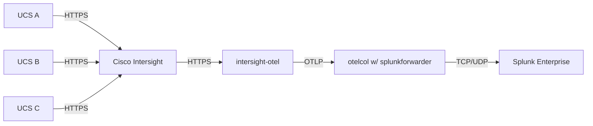

## BRKGRN-1022: Using Splunk & OpenTelemetry for centralized insights to achieve your sustainability goals

[About Cisco Live](https://www.ciscolive.com/global.html) | [**Link to Session Presentation**](/static/) | [**Link to Session Recording**](https://www.ciscolive.com) 

### Session Demo Objective

Ingest power consumption data from UCS hosts managed through [Cisco Intersight](https://intersight.com/help/saas/getting_started/overview) into [Splunk](https://splunk.com), leveraging the [OpenTelemetry standard](https://opentelemetry.io/) and utilize the ingested data with the [Splunk Sustainability Toolkit](https://splunkbase.splunk.com/app/6343) to report on emissions correlated through [Electricity Maps](https://www.electricitymaps.com/) data and enable the following two use-cases:
1. **Workload Activity Scheduler:** Adjust the planned schedule of electricity intensive activities to minimize their carbon footprint
2. **Change Workload Location:** Compute Potential CO₂e Savings From Location Changes

### Methodology



#### Notes

1. Intersight does not natively export OpenTelemetry, this is where the [intersight-otel](https://github.com/cgascoig/intersight-otel) utility helps. It pulls data from Intersight via API and converts into the OpenTelemetry standard.
2. Splunk Enterprise does not natively ingest OpenTelemtery, therefore, we need an [OpenTelemetry Collector](https://github.com/open-telemetry/opentelemetry-collector) to ingest OpenTelemetry and write JSONL files to a directory that a Splunk forwarder watches.
3. The rest of the magic happens inside of Splunk with the Splunk Sustainability Toolkit!

### Setup

> [!IMPORTANT]
> **Pre-requisites:** Cisco Intersight with your UCS devices onboarded & Splunk Enterprise

1. Setup Intersight OpenTelemetry Collection
    1. [intersight-otel](https://github.com/cgascoig/intersight-otel): easiest way to get started may be to pull down a binary of the [latest release](https://github.com/cgascoig/intersight-otel/releases) (for more information on this utility, check out Chris Gascoigne's Cisco Live 2023 [session slides](https://www.ciscolive.com/c/dam/r/ciscolive/emea/docs/2024/pdf/DEVNET-2118.pdf))
2. Setup an OpenTelemetry Collector & Splunk Forwarder (install on the same host)
    1. [otelcol](https://github.com/open-telemetry/opentelemetry-collector): easiest way to get started may be to pull down a binary of the [latest release](https://github.com/open-telemetry/opentelemetry-collector/releases)
    2. [splunkforwarder](https://www.splunk.com/en_us/download/universal-forwarder.html?locale=en_us): follow the instructions [here](https://docs.splunk.com/Documentation/Forwarder/9.2.1/Forwarder/Abouttheuniversalforwarder)
3. Setup Splunk Enterprise
    1. Create a new events index called `otel` for the OpenTelemetry events streaming from the forwarder (in production, it is assumed that OpenTelemetery from multiple sources lands in this index; you could differentiate the sources, for example: Intersight, AWS CloudWatch etc. using the `source`, `sourcetype` or `host` fields in Splunk).
        1. Use Splunk [Field Extraction](https://docs.splunk.com/Documentation/SplunkCloud/latest/Knowledge/ExtractfieldsinteractivelywithIFX) to extract your device/host/asset into a new field called `hostname`. 
    2. Download & install the following from Splunkbase: 
        1. [Splunk Sustainability Toolkit](https://splunkbase.splunk.com/app/6343)
        2. [Splunk App for Lookup File Editing](https://splunkbase.splunk.com/app/1724)
        3. [Splunk Add-on for Electricity Carbon Intensity](https://splunkbase.splunk.com/app/7089) & configure it:
            1. Navigate to the Splunk Add-on for Electricity Carbon Intensity to add your electricity maps account under **Configuration > Add** with the URL `https://api.electricitymap.org/v3` & your API key.
            2. Go to **Inputs > Create New Input**, select **Electricity Maps Carbon Intensity - Latest** & configure one or more electricity data inputs. See Electricity Maps zone documentation for a list of available zones:
                1. Name: `myemaps`
                2. Interval: `3600` or whatever works for you
                3. Index: `electricity_carbon_intensity`
                4. Electricity Maps Account: `myemapsaccount`
                5. Zone(s): `CH,DE,US-CAR-DUK,US-CAL-LDWP`
        4. (optional; if you want predictive trends) [Machine Learning Toolkit](https://splunkbase.splunk.com/app/2890) & [Python for Scientific Computing](https://splunkbase.splunk.com/app/2882)
    3. Follow instructions in the sections below to get the Sustainability Toolkit to work with Intersight OpenTelemtry data


### Working with the Splunk Sustainability Toolkit

Numerous Search Macros and Saved Searches/Reports are used to break up the SPL used in the Sustainability Toolkit, into manageable components. This visualisation shows the interdependencies:


A detailed description of each search macro is available within the app under **Documentation > Object Reference > Object Reference: Search Macros**

Some of these macros need to be adjusted to work with OpenTelemetry data as they have been authored to support Redfish data by default.

> [!TIP]
> All required adjustments have been pre-packaged into a python script [available here](/py/otel-sst-quickstart.py) that can serve as a quickstart to automate these changes for you in your Splunk instance. However, all adjustments have also been documented below for reference and manual execution (click on the sections below to view details).

<details>
<summary><strong>Adjust Power Macros</strong></summary>

1. In Splunk, browse to **Settings > Advanced Search > Search Macros**.
2. Clone `power-asset-location` and name it `power-asset-location-old`. This is to save the old search if you want to revert to using redfish data with Sustainability Toolkit in the future.
3.  Create a new search macro named `power-otel` with the following search: 
    ```spl
    index=otel 
    | spath input=_raw output=resourceMetrics path=resourceMetrics{} 
    | mvexpand resourceMetrics 
    | spath input=resourceMetrics output=myAttributes path=resource{}.attributes{} 
    | spath input=resourceMetrics output=metrics path=scopeMetrics{}.metrics{} 
    | mvexpand metrics 
    | spath input=metrics output=metricName path=name 
    | search metricName="hw.host.power-Sum" 
    | spath input=metrics output=dataPoints path=gauge.dataPoints{} 
    | mvexpand dataPoints 
    | spath input=dataPoints path=asDouble output=powerConsumed 
    | spath input=dataPoints path=timeUnixNano output=timeUnixNano 
    | eval _time=strftime(tonumber(timeUnixNano)/1e9, "%F %T"), AverageConsumedkW=round(powerConsumed/1000, 3) 
    | rename hostname as "Asset IP" 
    | table _time, "Asset IP", AverageConsumedkW
    ```
    This formats the OTel json into the format that Splunk Sustainability Toolkit expects to see.
    Edit permissions on `power-otel` for everyone the Sustainability Toolkit app to read and write the search.

4. Edit `power-asset-location` and replace the search for `power-redfish-snmp ` with the new macro `power-otel`.

<br>
</details>

<details>
<summary><strong>Adjust Carbon Intensity Macro</strong></summary>

1. In Splunk, browse to **Settings > Advanced Search > Search Macros**.
2. Clone `electricity-carbon-intensity-for-assets` and rename it to `electricity-carbon-intensity-for-assets-old`.
3. Edit `electricity-carbon-intensity-for-assets` to be replaced with the following:
    ```spl
    index=`electricity-carbon-intensity-index` 
        [         
        | search index="otel" 
        | stats values(hostname) as "Asset IP" 
        | mvexpand "Asset IP" 
        | lookup `cmdb-lookup-name` "Asset IP" OUTPUTNEW Site 
        | lookup `sites-lookup-name` "Site" OUTPUTNEW "Electricity CO2e per kWh Source" "Electricity CO2e per kWh Source Location Code" 
        | fields "Electricity CO2e per kWh Source" "Electricity CO2e per kWh Source Location Code" 
        | dedup "Electricity CO2e per kWh Source" "Electricity CO2e per kWh Source Location Code"
        | eval sourcetype='Electricity CO2e per kWh Source' 
        | eval postcode=if('Electricity CO2e per kWh Source'=="NG:carbonintensity:postcode",'Electricity CO2e per kWh Source Location Code',NULL) 
        | eval zone=if('Electricity CO2e per kWh Source'=="EM:carbonintensity",'Electricity CO2e per kWh Source Location Code',NULL) 
        | fields sourcetype, postcode, zone ] 
    | eval co2perkWh=coalesce(carbonIntensity,'intensity.forecast') 
    | eval LocationCode="Intensity_".sourcetype."/".coalesce(zone,postcode) 
    | eval _time=floor(_time) 
    | appendpipe 
        [| head 1 
        | fields _time 
        | addinfo 
        | eval TimeList=mvrange(info_min_time,info_max_time,"10m") 
        | mvexpand TimeList 
        | rename TimeList AS _time 
        | eval LocationCode=0, co2perkWh="" ] 
    | xyseries _time, LocationCode, co2perkWh
    | fields - 0 
    | filldown
    ```
<br>
</details>

<details>
<summary><strong>Enabling scheduled summarization in sustainability toolkit</strong></summary>

1. Browse to **Settings > Knowledge > Searches, Reports, and Alerts**. You may need to change the owner search to All.
2. Edit search for `Summarize Asset CO2e & kW V1.0` and `Summarize Electricity CO2e/kWh V1.0` and remove the commented `mcollect` lines in both searches.
3. **Edit > Edit schedule** for those searches to run hourly. *Note:* You can run them more frequent if you need to troubleshoot setup, but carbon intensity data still summarizes in 1h spans, so some of the dashboard may lag to populate.

</details>


### Results

Give some time for data to flow & scheduled summarization to run, but once it does, you can now leverage all of the out of the box working dashboards with your OpenTelemetry data to begin reporting on your sustinability outcomes!

**Change Workload Location**


**Workload Activity Scheduler**


<br>

--- 

Please note that content in this repository will not be kept up to date with new code releases/patches. If you're a Cisco Live attendee, you may create an issue on this repository or reach out to us via email for queries and/or feedback.

Oh and, while you're here, you may want to check out [some of our other content](https://github.com/ciscomanagedservices) as well 🚀 

Contributors:

1. Aman Sardana (amasarda@cisco.com)
2. Steve Holl (sholl@cisco.com)

Cisco CX Lifecycle Services & Automation, June 2024